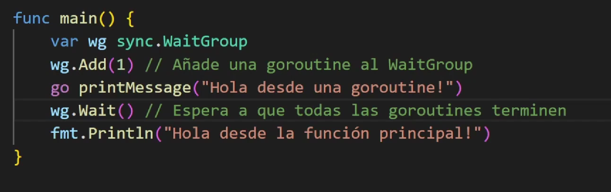
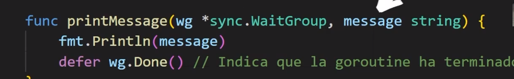

# Wait Group

Es una forma de sincronizar las go routines, es decir, yo te indico cuantas llamadas voy a esperar



ahora aqui tenemos que cerrar la GoRoutine y como lo hacemos con .Done()



Ojo si nuestra funcion tiene otra llamada a otra goroutine entonces debedemos de meterla antes

``` go

var wg sync.WaitGroup

wg.Add(1)
go func() {
    defer wg.Done()
    fmt.Println("Primera llamada")
    
    // Agregala antes de que sea iniciada
    wg.Add(1)
    go func() {
        defer wg.Done()
        fmt.Println("Llamada anidada")
    }()
}()

wg.Wait()

```

Consejo: No puedes agregarla una ves inicio, tiene que ser antes

## Patron Worker pool

Cuando no sabemos cuantas llamadas haremos es decir puede varias, puede ser una,dos o varias entonces utilizamos un patron para mandarlos a llamar

``` go
// Creamos una cantidad de canales considerable
tasks := make(chan Task, 100)
var wg sync.WaitGroup

// Recorremos, agregamos primero y despues mandamos la goRoutine
for i := 0; i < 3; i++ {
    wg.Add(1)
    go worker(tasks, &wg)
}
// A tasks le pasamos el valor de task uno, aqui esta simplificado pero puede ser cualquier cosa
tasks <- task1
tasks <- task2

//Cerramos el vanal cuando terminemos
close(tasks) 

// Para el programa hasta que todos terminen.
wg.Wait()


// una ves terminado podemos recorrer para ver tasks

    for task := range tasks {
        fmt.Println(task)
    }
```