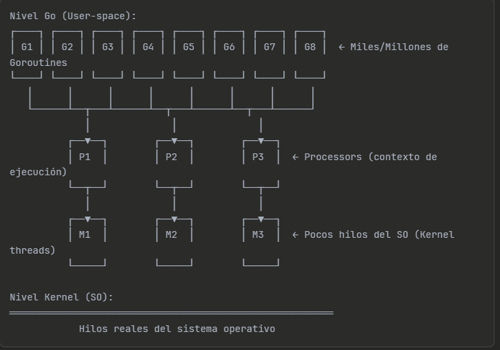

## G = Goroutine

 1. ***Unidad de trabajo***: posee todo lo que necesita una Goroutine
 2. Tiene su propio Stack: El punto exacto en donde va mi codigo
 3. Su estado: Si esta running, waiting, ran.
 4. Stack dinamico: Si tienes un recursion profunda crece, Si la recursion termina se encoje

 ### Unidad de trabajo

 Que realmente quiere decir cuando decimos que es una unidad de trabajo. En este punto la unidad de trabajo es lo minimo necesario para ejecutar codigo.

Esto puede ser un poco confuso ya que las funciones tambien puede ejecutar codigo pero no son independientes como si lo es las Goroutine.

Las Goroutine pueden vivir hasta que main finalice, ***Main es una GoRoutin Especial*** pero esta si se acaba, todas las go routine.

Que lo hace independiente

1. Tiene su propia pila de llamadas,parametros,variables locales.
2. Tiene su propio hilo independiente de ejecucion.
3. Tiene su propio cursor que marca en donde va la funcion.

Pero porque no son independientes totales

1. Comparten heap
2. Todos usan los mismo files, sockets,description,etc.
3. Comparten variables externas globales. <- es decir su memoria.

### Hilos ligeros

Este tema es un poco confuso de entender pero vamos a aclarar 2 cosas, primero que es un hilo normal y que es un hilo ligero

#### Hilo Normal

- Gestionado por el SO
- Nivel Kernel

#### Hilo Ligero

- Gestionado por go
- Contexto independiente
- Se introduce a un hilo normal por medio de una tecnica llamada multiplexadas 

